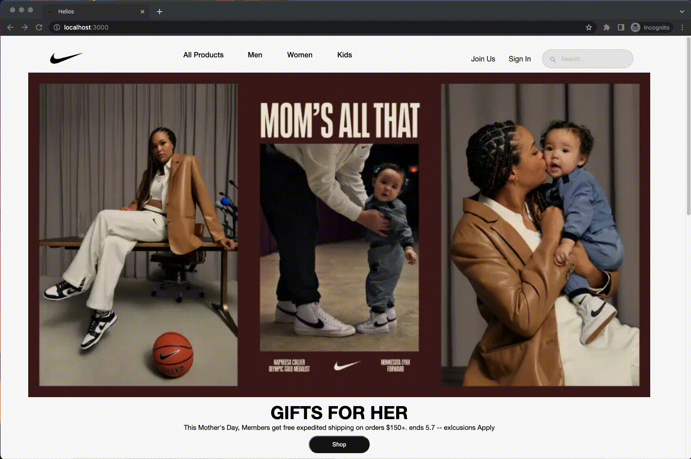

# Production README

Welcome to Heelios! A clone of the popular sneaker/apparel store Nike! It was a blast to make and it challenged me to learn new things! Please check it out [here](https://heelios.herokuapp.com/)!
# Table of Contents
1. [Technologies](#technologies)
2. [Features](#features)
3. [Technical Implementations](#technical-implementations)
4. [Future Features](#future-features)
5. [Thanks](#thanks)

# Technologies

### Frontend
+ ```React``` - a free and open-source front-end JavaScript library for building user intefaces based on components
+ ```Redux``` - used with React to handle application state
+ ```JavaScript``` - main language React is written with
### Backend
+ ```Ruby On Rails``` - server side web application framework writtein in Ruby
+ ```AWS S3``` - Amazon cloud service for storing and recalling image assets
+ ```Bcrypt``` - Library used to hash/salt passwords for user authentication
+ ```PostgreSQL``` - free and open-source relational database management system

# Features
There are 4 main features in my app Heelios:
1. Account creation and log in
2. Adding items to the bag, removing items from the bag, and editing items that are in the bag
3. Creating, editing, and deleting reviews
4. Favoriting products, adding items to cart from the favorites tab

### Account Creation/Log In

Users are able to create accounts using ```Bcrypt``` to hash their passwords. Passwords aren't saved directly onto the website. Instead, we keep the password digests and use built in Bcrypt methods to check if the credentials are correct. Some of the hard parts of this was definitely error handling as well as 



### Products

A lot of products were seeded directly from the nike website to create a robust shoping experience for users. Users are able to search for products, look at categories, as well as filter out specific products.

Products Page:
<br>


Product Page:
<br>


### Carts
The carts features was incredibly fun for me to make. Primarily because I personally love shopping so being able to dive deep into this feature and really understand what happens when I add a product to cart in a different website was incredibly eye-opening. Some of the challenges I faced with creating carts were that updating items in the cart weren't updating in real time. 


### Reviews

Users are able to create and edit reviews for products. My favorite part of the reviews are the average review stars I added at the top of the reviews. It takes the average reviews from all reviews and renders the number of stars onto the page. 


### Product Favoriting

Users are also able to favorite products. Users are able to create favorites from two locations, the cart page as well as the prouct show page. From the favorites page, users are able to add products to their cart as well. Users are also able to delete favorites.


# Technical Implementations

#### Average Reviews:
This is the average review code and render that I mentioned above. This code was fun to write because I figured out how to create a number of stars based on the average. I had to create an Array from the average rating and then map over each index and add 1 single star. From there, I rendered them onto the page.
```JS
  const averageRatings = (reviews) => {
    const total = reviews?.reduce((acc, review) => acc + review.rating, 0)
    const averageRating = reviews.length > 0 ? Math.round(total / reviews.length) : 0;
    return averageRating
  }

  const averageRating = averageRatings(reviews)

  <strong>Average Rating: </strong> 
        {Array.from(Array(averageRating).keys()).map(numStar => {
          return (
              <AiFillStar key={`rating-${numStar}`}/>
          )
        })}
```


#### Thunk Actions:
These are my thunk actions to make my numerous fetches back to my database to receive the correct products. 
```JS
export const fetchProductsBySku = (productId) => async(dispatch, getState) => {
  let res = await fetch(`/api/products?sku=${productId}`)
  let products = await res.json()
  dispatch(receiveProducts(products))
}

export const fetchProductsByCategory = (category) => async(dispatch, getState) => {
  let res = await fetch(`/api/products?category=${category}`)
  let products = await res.json()
  dispatch(receiveProducts(products))
}

export const fetchProductsByQuery = (query) => async (dispatch, getState) => {
  const res = await csrfFetch(`/api/search${query}`)
  const products = await res.json();
  dispatch(receiveSearchProducts(products))
}

export const fetchProductsByLimitandOffset = (limit, offset=0) => async (dispatch, getState) => {
  const res = await csrfFetch(`/api/products?limit=${limit}&offset=${offset}`)
  const products = await res.json()
  dispatch(receiveProducts(products))
}
```
#### Creating a mini index within my product show page

```JS
  useEffect(() => {
    if(id){
      dispatch(fetchProductsBySku(id))
        .finally(() => setLoading(false))
    }
  },[dispatch, id])

{products.map((product) => {
  return(
    <Link to={`/products/${product.sku}`} className="color-selector-link" key={`${product.id}-00`}>
        
        <input type="radio" value={product.sku} id={product.sku} name="color" key={`${product.id}-02`} className="product-show-input"/>
        <label className="color-selector-item" htmlFor={product.sku} key={`${product.id}-03`}></label>
    </Link>
  )
})}
```


# Future Features

In the future I'd like to add:
+ User Profiles/addresses for a better checkout process
+ Grouping like products on the products index page together/only rendering 20 products at the time.

# Thanks

Would love to say thanks to all of my classmates and teachers that helped me at any point in this project! Brian, Eduardo, Ningxiao, Taylor, Diego, Abby, and Darren! Thanks for all the help!
